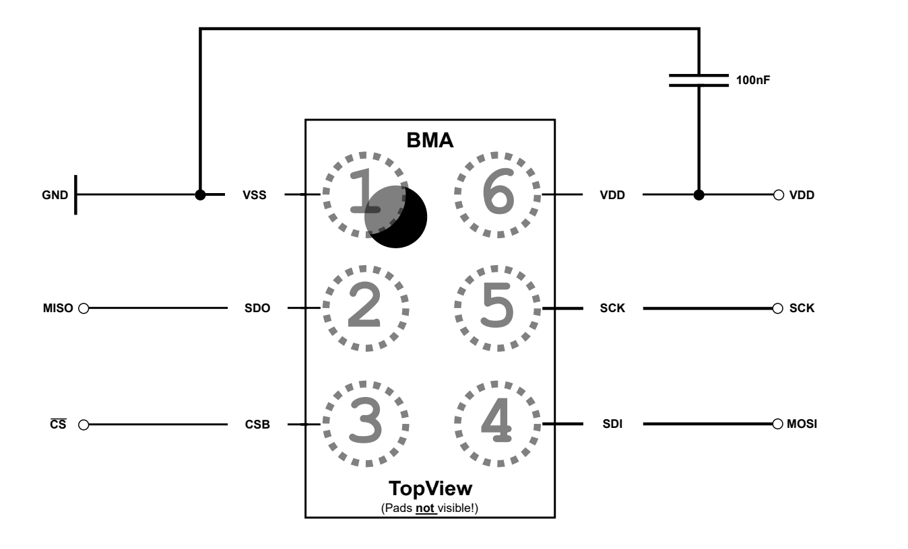
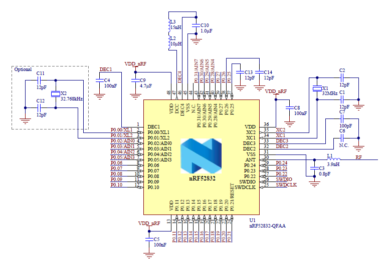
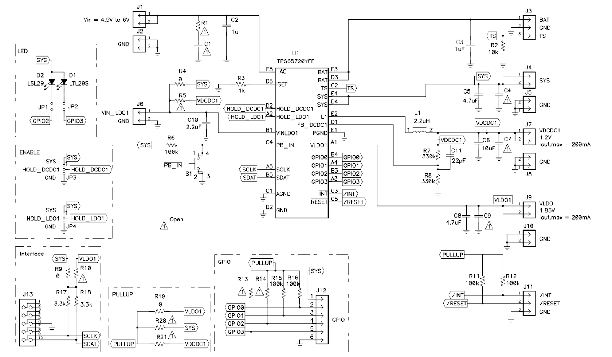

# ece445notebook

## Battery voltage
April 26

3 V = 2154

2 V = 1494

1.6 V = 1220

float batteryVoltage = 0.0014989*(float)ADC_VAL - 0.2286306;

## Meeting minutes
April 22
3d print: 

Start button stop button

Live processing and update graphs

Email charlie nudelman to ask about room, microphone, speaker. 
PDM 

## BLE debugging
April 20 

Debug missing frames. There were no missing frames.

Record ticks and compare with expected. Number of frames and number of ticks matched up.

## PDM
April 19

1.2 to 3 MHz clock

Have to add PDM2PCM library to linker
https://www.st.com/resource/en/user_manual/um2372-stm32cube-pdm2pcm-software-library-for-the-stm32f4f7h7-series-stmicroelectronics.pdf
https://community.st.com/t5/mems-sensors/sai-configuration-with-pdm-interface/td-p/592539?attachment-id=21636
https://www.st.com/resource/en/user_manual/um2372-stm32cube-pdm2pcm-software-library-for-the-stm32f4f7h7-series-stmicroelectronics.pdf

Clock frequency = bit depth * 2 * audio sample rate
((PDM_Clock_Freq) / 16 ) * 2

File with reference code: Cca02m2_audio.c

### DMA 
April 19

Setup and start PDM DMA

Rx half callback: If flag1=1, record a missed frame. Set flag1 = 1. 

Rx full callback: If flag2=1, record a missed frame. Set flag2 = 1. 

### Superloop
if(flag1), filter the first half of the buffer. Set flag1=0
if(flag2), filter the second half of the buffer. Set flag2=0

## Debugging Flash memory on pcb round 3
April 16

Able to read ID.

Need to call command and receive

External Clocks work

### Reset

Only need to send HAL_QSPI_COMMAND because we are not sending or receiving any data.

### Read page
1. Only need to send HAL_QSPI_COMMAND because we are not sending or receiving any data.
2. 17 bit address
3. Read from cache x2

Successfully reade 64 bits

13 bit address

### Write
1. Write enable
2. Set protection bits to unlocked
3. Program load random data x2
4. Program execute 
5. Get feature

DON’T PARTIAL PAGE WRITE. Do the full 4352

17 bit row address for read page and program execute. 

Always use column address of 0 for full page write for read from cache and program load.

Need to divide clock by 4. When using hse.

# Third Round PCB
April 15

Third round PCB came in

## Assembly using oven
1. Turn on manual mode
2. Setup profile according to solder paste. ta=180, tb=240, max temp = 249C
3. Turn on heating
4. Apply solder paste and place components
5. Place the pcb on a rack. Fully pull to the other side. A timer will start and the heaters will audibly turn off. 

## Debugging PCB 
Vdd and gnd were shorted together. It was probably too much solder paste/flux underneath the mcu. Bridging the center pad to a vdd pad.

We thought RF and gnd were shorted. But it's probably an internal inductor from RF to ground. 

Removed mcu with hot air. Wicked most of the solder from the center pad. Reattached mcu with hot air. No more short between vdd and gnd.

## Debugging Power supply subsystem
Had to remove the connection from the feedback pin to ground.

# PCB Round 1
## Debugging Flash memory on pcb round 1

April 10

[Datasheet](https://www.micron.com/content/dam/micron/global/secure/products/data-sheet/nand-flash/70-series/m70a-4gb-3v-nand-spi.pdf)

## QSPI

1. Init
2. Handle
3. Command
4. Receive / transmit

No signal on IO0, IO1, CS

Signal on SCK

TODO compare with dev board. 

Check if IO0, IO1, CS work as gpio. PB9, PB8, PA2. THey are shorted to Vdd. Drawing a lot of current when trying to pull low, but voltage stays at vdd. Seems to be fried either internal cmos or overvoltage protection diode.

### Clock
April 7

Boots from mid speed internal clock

Then, you can change master clock source

Systick not working, causing problems with hal delay and hal tick

For some reason boot0 is stuck high, causing problems with interrupts on boot

Fix: Manually set NSWBoot to 0 using stm32programmer. This forces boot from an internal flash instead of somewhere else. Then, systick starts working. But, still no signal on IO0, IO1, CS

# Second PCB order
Week of 3/23

1. Changed antenna to smaller chip antenna
2. Moved some components to the back: battery holder, pull up resistors, voltage dividers
3. Added v2s200d sensor
https://www.syntiant.com/v2s
4. Changed bma580 shuttle Mount to a single row of headers
5. Made PCB smaller

# PCB Round 1 Assembly
Populated first PCB. I was able to successfully program it and enter step through debug mode.

Figured out how to use reflow oven. Set oven to manual mode. Be sure to push tray all the way to one side. 

TODO work on communicating with flash memory.

# Week of 3/8
Soldered connections onto the bma580 shuttle board
Made a demo that continuously reads acceleration data, fills a buffer, and calculates the variance of acceleration data to approximate SPL calculations.
Presented breadboard demo.

# Week of 3/1
BMA580 commands

1. High power mode
2. Suspend: 0x04 0x00
3. Enable accelerometer: acc_conf0 0x0F
4. acc_conf1 0b10101100
5. Acc_conf2 0b00000100

# Week of 2/25
Put in order for MCU dev board and accelerometer dev board

TODO this: get in contact with charlie and pasquale. Give them an update about us continuing with our project. Inform them about our high level requirements. 

## Schematic design
Links: [NRF52832](https://docs.nordicsemi.com/bundle/nRF52832_PS_v1.9/resource/nRF52832_PS_v1.9.pdf), [bma580](https://www.bosch-sensortec.com/media/boschsensortec/downloads/datasheets/bst-bma580-ds000.pdf), [4 gbit flash memory](https://mm.digikey.com/Volume0/opasdata/d220001/medias/docus/5482/MT29FxGxxAxxDAxx_RevQ_Apr2014.pdf), [pmic](https://www.ti.com/lit/ds/symlink/tps65720.pdf?ts=1740480684604&ref_url=google.com), [PCB design guide for nrf52832](https://devzone.nordicsemi.com/guides/hardware-design-test-and-measuring/b/nrf5x/posts/general-pcb-design-guidelines-for-nrf52)

start with reference designs
## NRF
Nrf can either use internal LDO or internal dc to dc converter to step down ~3.3 V Vdd to 1.3 V system voltage. Using the internal DC to DC converter requires extra components, but uses less power.

External crystal 2: An external 32 kHz crystal will give lower average current consumption than using the internal RC oscillator, at the expense of cost and board space. In total, this gives 8-10 µA extra average current consumption. Depending on application, this may be enough to justify the cost and board space for a crystal.

### QFAA vs QFAB
QFAA has 512 kb of flash. QFAB has 256 kb of flash.
### How to program?
Need to use swd and some programmer such as j-link or st-link. The st-link I have will work for programming but not debugging.
Need to add connections for swdio and swdclk. Pins vs pads. If using pins, use some known layout.

USB

### BMA580

Multiple modes of operation: i2c, i3c, spi 3 wire, spi 4 wire

### MT29F4G08ABBDAWP

# Week of 2/18
Weekly meeting with Chi Zhang at Tuesday 5:20-5:40

Ask about the package sizes we are using. Is this feasible? Does the reflow oven in the lab work well? 

## Attended PCB review and talked with prof viktor Gruev
Programmability

Think of changing components to simplify, ease of use, manufacturing

### New components
STM32 with Bluetooth

Breakout to accelerometer

Buck boost into ldo

r1=r2(vout/vfb-1)

r1/r2=vout/vfb-1

vout=(r1/r2+1)vfb

# Week of 2/17
Met with Jaden and Michael on 2/18 in preparation for proposal presentation

Proposal presentation preparation

Potential questions: why did you choose to use an accelerometer instead of a microphone? Why did you choose these numbers for your high level requirements? 

For proposal presentation: create software flow chart, describe mechanical overview, describe experiments for sensor choice, experiment for processing on chip
